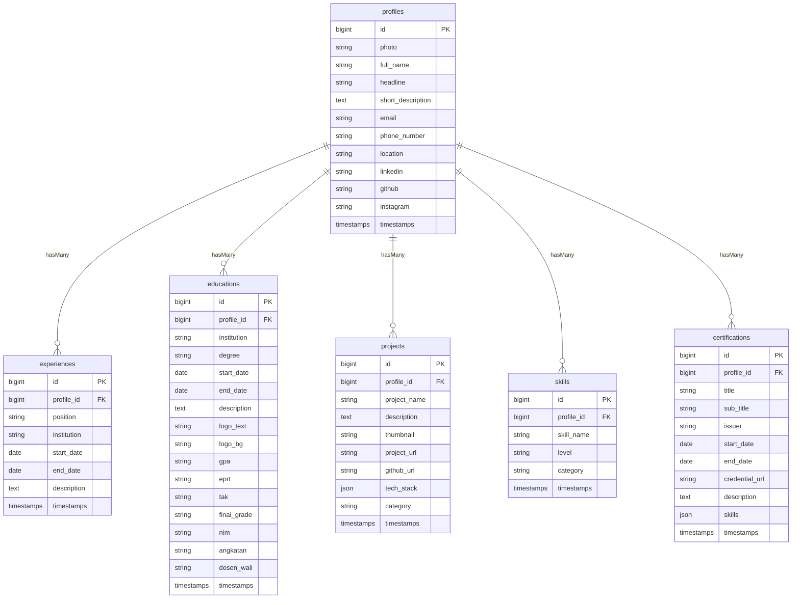

# Full Stack Personal Portfolio CMS (Laravel 12 + Tailwind + Alpine.js)

This project is a complete Full Stack Personal Portfolio Website designed and built as a response to the **Laravel Full Stack Developer Internship Technical Test**. It demonstrates database modeling, Eloquent relationships, Laravel Form Request validation, AJAX CRUD integration, storage utilization, and a premium modern UI/UX design.

---

## Tech Stack

*   **Backend:** Laravel 12, PHP >= 8.2
*   **Frontend:** Blade templates, Tailwind CSS (via CDNs), Alpine.js
*   **Database:** MySQL / MariaDB (via XAMPP)
*   **Storage:** Laravel Local Storage (public disk symlink)

---

## Main Features

1.  **Dynamic Database Content:** All sections (About, Experience, Education, Projects, Skills, Contact, Certifications) draw data directly from MySQL. No content is hardcoded in Blade views.
2.  **Interactive Modes:**
    *   **View Mode:** A clean, professional, responsive, and minimalist dark portfolio.
    *   **Edit Mode:** Instantly toggles edit overlays. Allows adding, editing, and deleting records in-place without page transitions or redirects.
3.  **AJAX CRUD Operations:** High-performance AJAX endpoints implemented using standard Laravel Controllers returning JSON, integrated with client-side Alpine.js Fetch handlers.
4.  **Laravel Form Request Validation:** Complete backend input schema validation with real-time error displaying inside interactive modals.
5.  **Image Upload Pipeline:** Seamless profile photo and project thumbnail uploads stored dynamically using Laravel Storage and displayed immediately on the interface.
6.  **Realistic Data Seeding:** A unified DatabaseSeeder populated with realistic developer profiles, work experience timelines, education records, project cards, professional credentials, and categorized skills.

---

## Installation & Setup

Follow these steps to set up and run the application locally:

### 1. Clone the Project & Install Composer Dependencies
Navigate to the project root directory and run:
```bash
composer install
```

### 2. Configure Environment Variables
Copy `.env.example` to `.env`:
```bash
cp .env.example .env
```
Ensure that your database variables connect to your local MySQL instance (e.g., XAMPP):
```env
DB_CONNECTION=mysql
DB_HOST=127.0.0.1
DB_PORT=3306
DB_DATABASE=portfolio_db
DB_USERNAME=root
DB_PASSWORD=
```

### 3. Create the Database
Create a MySQL database named `portfolio_db` using phpMyAdmin, MySQL Workbench, or command line:
```sql
CREATE DATABASE IF NOT EXISTS portfolio_db;
```

### 4. Run Migrations & Seeders
Run migrations to build the tables and seed them with the realistic sample data:
```bash
php artisan migrate:fresh --seed
```

### 5. Link Local Storage
Create the symbolic link to enable file uploads to be read by the web browser:
```bash
php artisan storage:link
```

### 6. Run the Local Server
Boot up the built-in development server:
```bash
php artisan serve
```
Open [http://127.0.0.1:8000](http://127.0.0.1:8000) in your web browser to view the application.

---

## Database Schema



---

## Folder Structure

The code is organized according to standard Laravel architecture conventions:

*   `app/Http/Controllers/`:
    *   [PortfolioController.php](file:///app/Http/Controllers/PortfolioController.php) - Loads page with seeded profiles and relations.
    *   [ProfileController.php](file:///app/Http/Controllers/ProfileController.php) - Updates profile data and manages files.
    *   [ExperienceController.php](file:///app/Http/Controllers/ExperienceController.php) - JSON API CRUD responses for experience.
    *   [EducationController.php](file:///app/Http/Controllers/EducationController.php) - JSON API CRUD responses for education.
    *   [ProjectController.php](file:///app/Http/Controllers/ProjectController.php) - JSON API CRUD responses for projects and file uploads.
    *   [SkillController.php](file:///app/Http/Controllers/SkillController.php) - JSON API CRUD responses for skills.
    *   [CertificationController.php](file:///app/Http/Controllers/CertificationController.php) - JSON API CRUD responses for certifications.
*   `app/Http/Requests/`:
    *   [ProfileRequest.php](file:///app/Http/Requests/ProfileRequest.php) - Validation rules for profile information.
    *   [ExperienceRequest.php](file:///app/Http/Requests/ExperienceRequest.php) - Validation rules for work experience.
    *   [EducationRequest.php](file:///app/Http/Requests/EducationRequest.php) - Validation for academic credentials.
    *   [ProjectRequest.php](file:///app/Http/Requests/ProjectRequest.php) - Validation rules for projects.
    *   [SkillRequest.php](file:///app/Http/Requests/SkillRequest.php) - Validation rules for technical skills.
    *   [CertificationRequest.php](file:///app/Http/Requests/CertificationRequest.php) - Validation rules for professional credentials.
*   `app/Models/`:
    *   [Profile.php](file:///app/Models/Profile.php), [Experience.php](file:///app/Models/Experience.php), [Education.php](file:///app/Models/Education.php), [Project.php](file:///app/Models/Project.php), [Skill.php](file:///app/Models/Skill.php), [Certification.php](file:///app/Models/Certification.php)
*   `database/migrations/`:
    *   Schema definitions mapping primary keys, foreign key constraints (cascading deletes), data types, and timestamps.
*   `database/seeders/`:
    *   [DatabaseSeeder.php](file:///database/seeders/DatabaseSeeder.php) - Populates all tables with realistic data.
*   `resources/views/`:
    *   [layouts/app.blade.php](file:///resources/views/layouts/app.blade.php) - Base HTML layout structure containing tailwind configs, CDNs, and headers.
    *   [portfolio.blade.php](file:///resources/views/portfolio.blade.php) - Unified landing template rendering segments, toggle state, and Alpine.js controllers.
*   `routes/web.php` - Map of landing view, update, store, and delete endpoints.


---

## Suggested Git Commits

For a natural git commit progression matching technical test expectations, you can follow this list:

*   **Commit 1:** `git commit -m "feat: Initialize Laravel 12 Project"`
*   **Commit 2:** `git commit -m "feat: Create Database Migrations for portfolio relations"`
*   **Commit 3:** `git commit -m "feat: Implement Profile model & AJAX update controller"`
*   **Commit 4:** `git commit -m "feat: Implement Experience model & CRUD endpoints"`
*   **Commit 5:** `git commit -m "feat: Implement Education model & CRUD endpoints"`
*   **Commit 6:** `git commit -m "feat: Implement Project model, CRUD endpoints & thumbnail upload"`
*   **Commit 7:** `git commit -m "feat: Implement Skill model & CRUD endpoints"`
*   **Commit 8:** `git commit -m "feat: Design responsive dark modern Landing Page UI using Tailwind CSS"`
*   **Commit 9:** `git commit -m "feat: Integrate Alpine.js for in-place edit mode toggling and modal triggers"`
*   **Commit 10:** `git commit -m "feat: Connect Frontend forms with Form Request Validation and show errors in modals"`
*   **Commit 11:** `git commit -m "feat: Add dynamic image rendering immediately upon upload using Storage"`
*   **Commit 12:** `git commit -m "docs: Generate README installation and documentation guide"`
